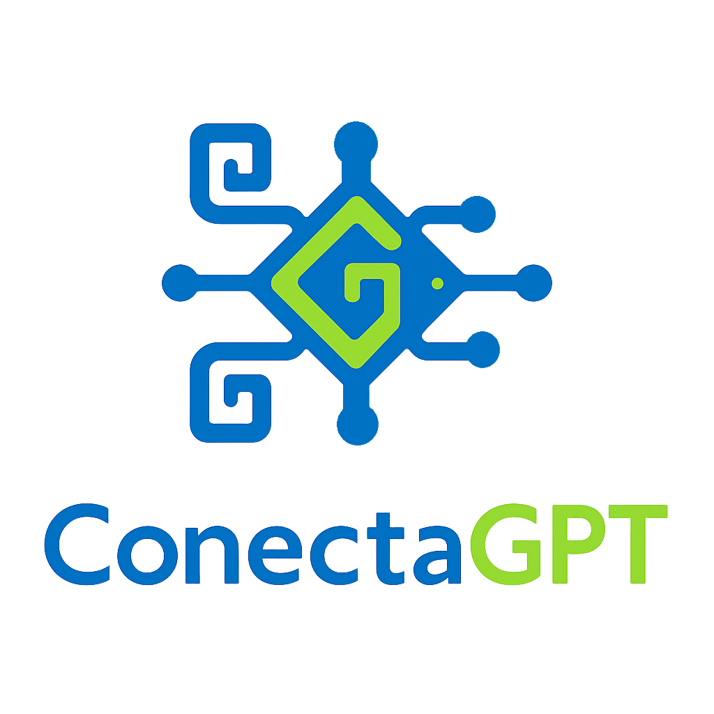

<p align="center">

</p>

<h1 align="center">ConectaGPT - Plataforma de IA en Español</h1>

<p align="center">
ConectaGPT es un fork completo de FlowiseAI específicamente adaptado para usuarios de habla hispana. Incluye localización integral al español y rebranding completo.
</p>

## 🌟 Características Principales de ConectaGPT

### ✅ Localización Completa al Español

-   **Interfaz 100% en español**: Toda la UI ha sido traducida usando react-i18next
-   **Contenido culturalmente adaptado**: Traducciones naturales para Latinoamérica y España
-   **Fallback en inglés**: Mantiene compatibilidad con idioma inglés
-   **SEO optimizado**: Meta tags y contenido optimizado para búsquedas en español

### ✅ Rebranding Completo

-   **Nueva identidad visual**: Logos y assets personalizados de ConectaGPT
-   **Metadatos actualizados**: Package.json, manifest.json y configuraciones
-   **Referencias actualizadas**: Todos los links y menciones cambiados a ConectaGPT
-   **Dominios actualizados**: Preparado para https://conectagpt.com

## 🛠️ Cambios Técnicos Implementados

### Internacionalización (i18n)

```
packages/ui/src/i18n/
├── index.js                     # Configuración i18next
└── locales/
    ├── es.json                  # Traducciones en español (principal)
    └── en.json                  # Traducciones en inglés (fallback)
```

### Hook Personalizado

```javascript
// packages/ui/src/hooks/useTranslation.jsx
const { t, changeLanguage, currentLanguage } = useTranslation()
```

### Componentes Actualizados

-   **Logo**: Logos de ConectaGPT con fallback a Flowise
-   **AboutDialog**: Información de versión en español
-   **Chatflows**: Vista principal con traducciones completas
-   **Menús**: Navegación dinámica con i18n

### Assets y Configuración

```
packages/ui/src/assets/images/
├── conectagpt_white.svg         # Logo claro
└── conectagpt_dark.svg          # Logo oscuro

packages/ui/index.html           # Meta tags en español
packages/ui/public/manifest.json # App manifest actualizado
```

## 📦 Estructura de Traducciones

### Categorías de Traducción

```json
{
    "app": { "title": "ConectaGPT - Construye Agentes de IA, Visualmente" },
    "navigation": { "chatflows": "Flujos de Chat", "tools": "Herramientas" },
    "buttons": { "create": "Crear", "save": "Guardar", "cancel": "Cancelar" },
    "labels": { "name": "Nombre", "description": "Descripción" },
    "messages": { "welcome": "¡Bienvenido a ConectaGPT!" },
    "chatflows": { "title": "Flujos de Chat", "subtitle": "Construye sistemas..." }
}
```

## 🚀 Instalación y Desarrollo

### Requisitos Previos

-   Node.js 18.15+ o 20+
-   PNPM v9

### Instalación

```bash
# Clonar el repositorio
git clone https://github.com/ConectaGPT/ConectaGPT.git
cd ConectaGPT

# Instalar dependencias
pnpm install

# Desarrollo (español por defecto)
pnpm dev
# UI: http://localhost:8080

# Producción
pnpm build
pnpm start
# Server: http://localhost:3000
```

### Configuración de Idioma

El idioma español está configurado por defecto. Para cambiar:

```javascript
// packages/ui/src/i18n/index.js
i18n.init({
    fallbackLng: 'es', // Idioma por defecto
    lng: 'es' // Idioma forzado
})
```

## 🔧 Comandos Específicos de ConectaGPT

### Desarrollo

```bash
# Modo desarrollo con recarga automática
pnpm dev

# Construir solo UI
cd packages/ui && pnpm build

# Probar traducciones
# Visitar: http://localhost:8080?test-i18n=true
```

### Testing de Localización

```bash
# Lint completo
pnpm lint

# Formatear código
pnpm format

# Tests
pnpm test
```

## 📋 Lista de Archivos Modificados

### Configuración Principal

-   `package.json` → Nombre, autor, homepage
-   `packages/ui/package.json` → Metadatos UI
-   `packages/server/package.json` → Metadatos servidor
-   `packages/components/package.json` → Metadatos componentes

### Interfaz de Usuario

-   `packages/ui/index.html` → Meta tags español
-   `packages/ui/public/manifest.json` → App manifest
-   `packages/ui/src/index.jsx` → Inicialización i18n
-   `packages/ui/src/i18n/` → Framework completo i18n

### Componentes Clave

-   `packages/ui/src/ui-component/extended/Logo.jsx`
-   `packages/ui/src/ui-component/dialog/AboutDialog.jsx`
-   `packages/ui/src/views/chatflows/index.jsx`
-   `packages/ui/src/menu-items/dashboardTranslated.js`

### Assets

-   `packages/ui/src/assets/images/conectagpt_*.svg`
-   `packages/ui/src/hooks/useTranslation.jsx`
-   `packages/ui/src/test-i18n.jsx`

## 🔄 Mantenimiento del Fork

### Actualización desde Upstream

```bash
# Agregar upstream original
git remote add upstream https://github.com/FlowiseAI/Flowise.git

# Obtener cambios
git fetch upstream

# Mergear cuidadosamente (revisar conflictos en traducciones)
git merge upstream/main
```

### Consideraciones Importantes

1. **Traducciones**: Siempre revisar que las nuevas características incluyan traducciones
2. **Referencias**: Verificar que no se reviertan las referencias a ConectaGPT
3. **Assets**: Mantener los logos y assets personalizados
4. **Configuración**: Preservar la configuración de idioma español por defecto

## 📝 Próximos Pasos Sugeridos

### Integraciones Recomendadas

-   [ ] WhatsApp Business API (configuración para Latinoamérica)
-   [ ] Mercado Pago (método de pago local)
-   [ ] OXXO (método de pago México)
-   [ ] Pasarelas de pago locales adicionales

### Mejoras de Localización

-   [ ] Formato de fechas y números para español
-   [ ] Zona horaria por defecto para Latinoamérica
-   [ ] Mensajes de error específicos en español
-   [ ] Documentación de usuario en español

### Marketing y SEO

-   [ ] Sitemap optimizado para español
-   [ ] Keywords específicas para mercado hispano
-   [ ] Schema markup en español
-   [ ] Analytics configurado para regiones específicas

## 📞 Soporte

Para soporte específico de ConectaGPT:

-   **Email**: info@conectagpt.com
-   **Documentación**: https://docs.conectagpt.com
-   **Comunidad**: https://community.conectagpt.com

---

**Nota**: Este fork mantiene la licencia original de FlowiseAI. ConectaGPT es una adaptación comunitaria enfocada en el mercado de habla hispana.
